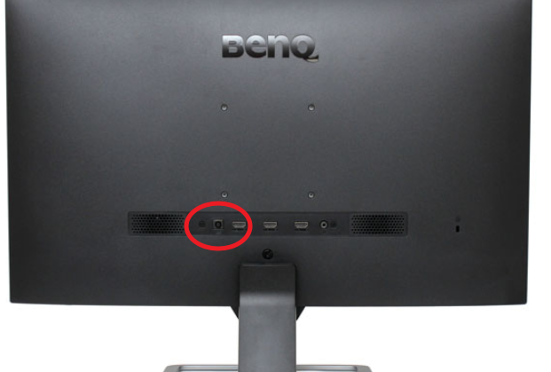
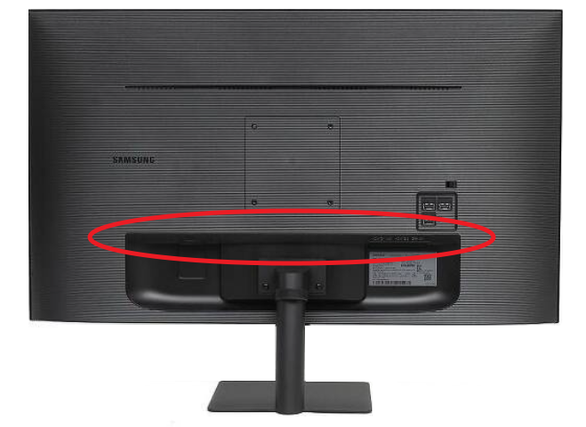

---

# DC Adaptor 구매 목적

개발환경을 구축하기위해 모니터를 3대 구매했어요...... 근데.. 전원케이블이 휘어서 어댑터를 구매하게 되었습니다.

# 현재 모니터 상황

제 3대 중 두대의 모니터는 아래와 같이 정면을 바라보는 형태로 구성되어있었어요

한대는 아래와 같이 어댑터 구멍이 아래를 향하고 있어요!

1번과 같이 정면을 바라보면 꼽기가 굉장히 수월하다는 장점이 있으나, 모니터 뒤에 장애물이 있으면 어댑터나 케이블 간섭 영향이 크다는 단점이 있어요

2번과 같이 아래를 바라보면 꼽기는 힘들어도 외부 간섭이 덜한 장점이 있어요.

트리플 모니터를 구성했는데 책상이 좁다보니 책장에 걸리적거리더라고요.... ㅠㅠ

그래서 어쩔수 없이 DC Adaptor 직각형을 알아보기로 하고 검색을 해보려고 합니다.

# 현재 가지고 있는 모니터의 Adaptor 잭의 크기는 무엇인가?

모니터 adaptor 잭의 크기를 재기가 어려웠어요. 5mm로 보이긴 하는데 내경이 2.1mm 인지, 2.5mm 인지 잘 모르겠더라고요.

그래서 아래와 같이 가정을 해서 구매하기로 결정했습니다. 배송비 두배로 날리는 것보다는 리스크가 적다고 판단됐어요.

| 직각 포인트는 모니터입력과 가까워야함.||
| -------------------------------------------------------------------------------------------------------------------------------------------------------------------------------------------------------------------------------------------------- | ------------------------------------------------------------------------------------------------------------------------------------------------------ |
| 주연테크가 5mm 2.5라면?                                                                                                                                                                                                                            | 주연테크가 5mm 2.1라면?                                                                                                                                |
| Adaptor DC 5mm 2.5mm 출력  Gender 직선 DC 5mm 2.5mm(MT345-입력) Gender 직선 DC 5mm 2.1mm(MT345-출력)  Gender 직각 DC 5mm 2.1mm(MT328-입력) Gender 직각 DC 5mm 2.5mm(MT328-출력)  Monitor DC 5mm 2.5mm 입력 | 주연테크가 5mm 2.1라면?  Gender 직각 DC 5mm 2.1mm(MT326-입력) Gender 직각 DC 5mm 2.1mm(MT326-출력)  Monitor DC 5mm 2.1mm 입력 |

  

|             |          Grouping           ||
First Header  | Second Header | Third Header |
 ------------ | :-----------: | -----------: |
Content       |          *Long Cell*        ||
Content       |   **Cell**    |         Cell |

New section   |     More      |         Data |
And more      | With an escaped '\|'         ||  

  

<table>
    <thead>
        <tr>
            <th>Layer 1</th>
            <th>Layer 2</th>
            <th>Layer 3</th>
        </tr>
    </thead>
    <tbody>
        <tr>
            <td rowspan=4>L1 Name</td>
            <td rowspan=2>L2 Name A</td>
            <td>L3 Name A</td>
        </tr>
        <tr>
            <td>L3 Name B</td>
        </tr>
        <tr>
            <td rowspan=2>L2 Name B</td>
            <td>L3 Name C</td>
        </tr>
        <tr>
            <td>L3 Name D</td>
        </tr>
    </tbody>
</table>
dd 
 
 

# DC Adaptor 검색 결과
